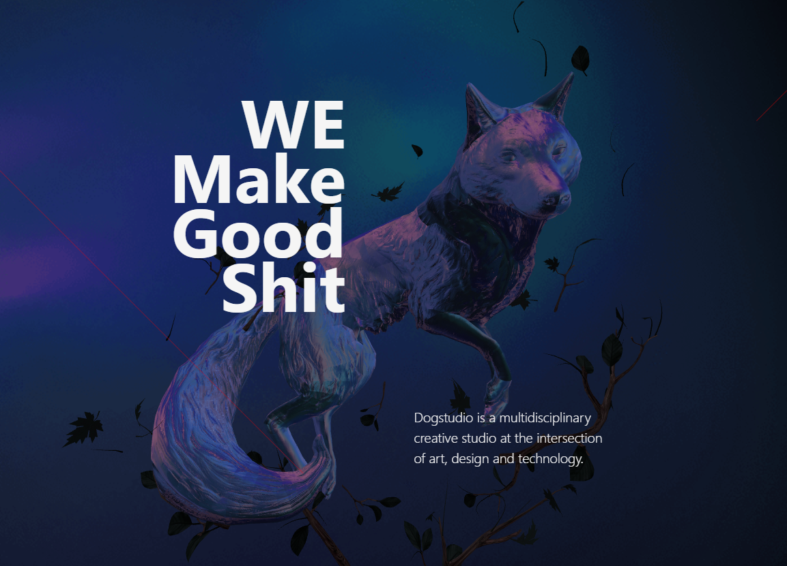

🚀 Dog Studio Clone (Three.js + React + GSAP)
📌 Project Overview

Yeh project ek Dog Studio website clone hai jo maine modern web technologies use karke banaya hai jaise:

React (Frontend UI)
Three.js (3D animations & models)
GSAP (Smooth animations & transitions)

Iska main goal hai ek highly interactive, visually attractive aur smooth animated website create karna — bilkul original Dog Studio jaisa feel dena.

🛠️ Tech Stack
⚛️ React.js
🎨 Three.js (React Three Fiber / Drei)
🎬 GSAP (GreenSock Animation Platform)
💨 Tailwind CSS (Styling ke liye)
✨ Features (Kya-kya banaya hai)
🔥 1. 3D Experience
Three.js use karke interactive 3D objects / scenes banaye
Smooth rendering aur camera movement
🎬 2. Smooth Animations
GSAP ke through:
Page transitions
Scroll animations
Text reveal effects
Hover interactions
🎨 3. Modern UI/UX
Clean aur professional layout
Responsive design (mobile + desktop friendly)
Smooth scrolling experience
⚡ 4. Performance Optimization
Lazy loading of components
Optimized rendering for 3D elements
📂 Project Structure (Simple samajh)
src/
 ├── components/   → Reusable UI components
 ├── assets/       → Images, models, textures
 ├── App.jsx       → Custom React hooks
 ├── main.jsx      → CSS / Tailwind config
▶️ How to Run Project
Step 1: Clone Repo
git clone (https://github.com/pratapravendra/Dog-GSAP.git)
Step 2: Install Dependencies
npm install
Step 3: Run Project
npm run dev
🎯 What I Learned (Maine kya seekha)
Three.js basics aur 3D rendering
GSAP se advanced animations kaise banate hain
React ke saath animation libraries integrate karna
Performance optimize karna (especially 3D websites me)
💡 Future Improvements
More advanced 3D models add karna
Better scroll-based storytelling
Backend integration (optional)

On-Hold review !
